```{r setup, include=FALSE}
knitr::opts_chunk$set(echo = TRUE, eval = FALSE)
```

## What are we going to create?

A static web page like [this one](https://ronnyhdez.github.io/drawer/) to manage
your documentation created in [Rmarkdown](https://rmarkdown.rstudio.com/)

## The problem:

Pretty often I found myself in situation where I say: "I did this sometime ago
and now I don't remember quite well which were the steps to do it again".

From my job and also current projects I'm always taking raw notes in a text file
file and despite the tons of apps out there, I like text files because they
are pretty simple and this allows me to just focus in writing down the idea,
concept or steps of what I'm doing and implement markdown.

But, the problem with this approach is that at the end of the day, I have my
desktop or other folders with a lot of individual `.md` or `txt` files laying 
around without any intuitive context. This got me in troubles and in loosing 
time when I wanted to get back to something that I did and that I had somewhere 
in my computer.

If at this point your are asking yourself: why you didn't use a wiki? or a 
vignette? or an Rmarkdwon file? or something more organized? The answer is simple:
In the middle of a project execution, when I doubt about something, I would go to
google or a reference book, grab what I needed and take a quick note about the
steps that I followed to accomplish my task. If it didn't work I would throw away
the file, if it worked, I would keep the file.

Then, I found out about [MkDocs](https://www.mkdocs.org/) (actually [Frans](https://twitter.com/fransvandunne)
was who showed me this) and it was the perfect solution: a simple web page,
an index and most important: a search toolbar that can search in all the web
page content (I mean, all my notes in there)!


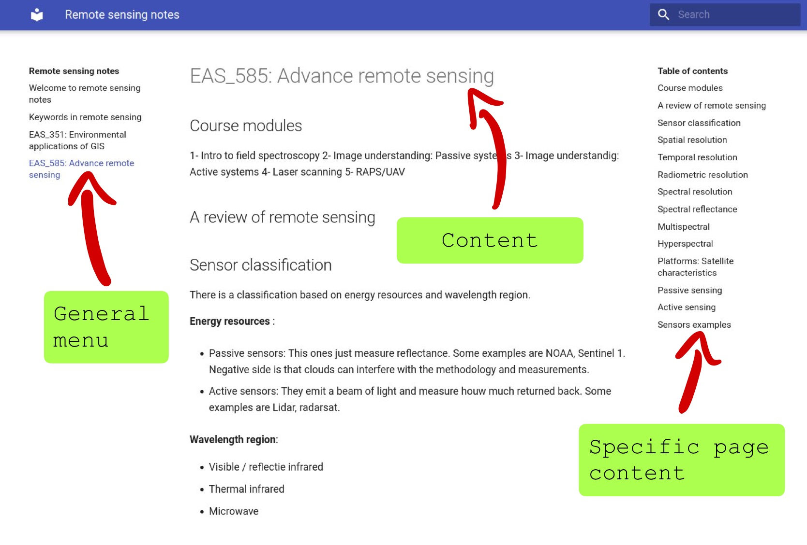

As they state in their site: 

> MkDocs is a fast, simple and downright gorgeous static site generator that's geared towards building project documentation. Documentation source files are written in Markdown, and configured with a single YAML configuration file.

Now, they state that **source files are written in Markdown**, but if I'm an
R user, probably I'm used to Rmarkdown files. Plus it's nice to create documents
in Rmarkdown where I can mix markdown and R code (R + markdown).

## So, how can I set up everything?

For this recipe, you will need:

 - R and RStudio
 - Rmarkdown package
 - MkDocs
 - git
 - GitHub account
 
I'm not going to describe how to install R RStudio, Rmarkdown or git. There are 
plenty good tutorials and documentation on how to do it out there. I'm going
to describe the process from the installation of MkDocs.

### Getting MkDocs

For this, I followed the instructions over [here](https://www.mkdocs.org/user-guide/installation/).
I got already python on my machine and I'm a Linux user, so I'm using 
Ubuntu 20.04

Given that I had already python I just installed MkDocs:

```{bash}
pip install mkdocs
```

Then I validated that the installation was succesful:

```{bash}
$ mkdocs --version
mkdocs, version 1.2.2 from /home/your_username/.local/lib/python3.8/site-packages/mkdocs (Python 3.8)
```

Done! I got MkDocs on my computer.

### Getting Matherial theme

I don't like the default theme that comes with MkDocs, so I changed to 
[Matherial](https://squidfunk.github.io/mkdocs-material/getting-started/).

To install this theme, you will need to run in the terminal:

```{bash}
$ pip3 install mkdocs-material
```

### Configuring your GitHub repository

You will need to have an account already on GitHub. When you are done with this
step, you can go and create a repository. Also you will need to go to 
settings, search for **Pages** on the left hand side menu and there select the
**main** branch to enable GitHub Pages for your repository.

The steps are the following:

**Create a new repository**

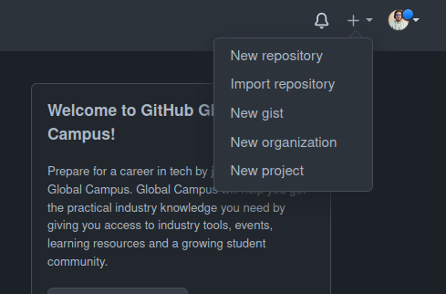


**Options for the new repo**


**Settings to enable GitHub pages**

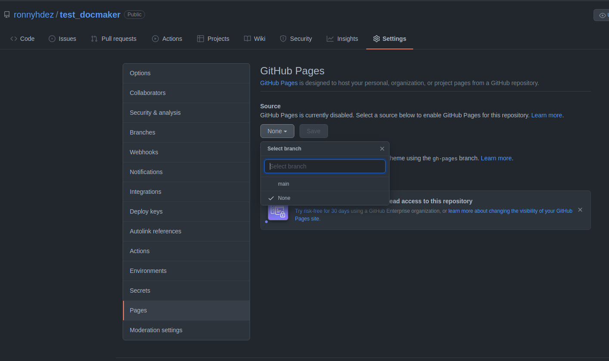

## Cloning your project

If you are already familiar with this step, skip this section and go ahead to 
the next session. If you are starting with git and GitHub here is the set of 
steps to clone your repo and start working.

Up to this point we just have created the repository on GitHub and tweak 
some settings. It's time to clone the repository created on GitHub to our
computer. We will be working with the RStudio IDE.

**Create new project**

 - Select the `Version Control` option
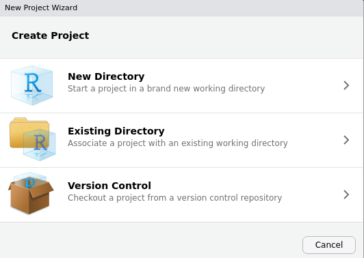

 - Then select the `Git` option
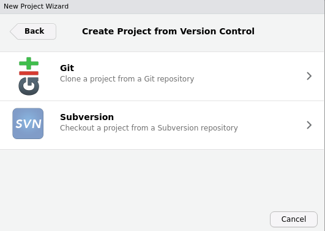

 - Now, go to your repository on GitHub and under the `Code` button copy the
 url. Make sure that the `HTTPS` option is highlighted.
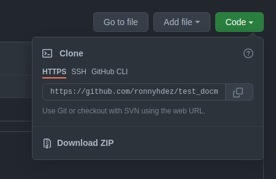

 - Copy the URL in the `Repository URL` section. The `Project directory name` should
 auto-populate. Then select your path where you want to locate your repository
 folder.
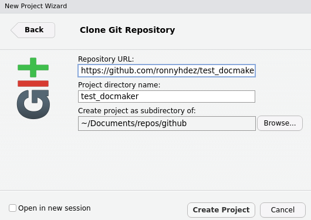

 - Now, RStudio should open a new session for working on your repository!
 
## Working on your notes

Now we are all set. We can start creating our Rmarkdown documents:

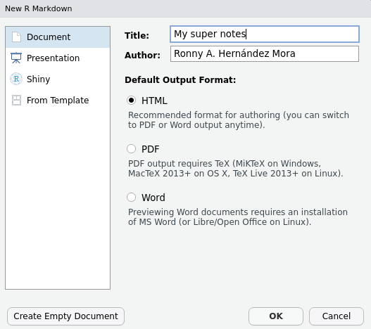

Create as many `Rmd` documents as you need. Each document will be a "section"
on your final website. 

Each of the titles and subtitles in your document will be sections inside the
specific page.

Also, use relative paths. This will make everything less error prone. 

Now, because we are going to use the package [docmaker](https://github.com/ronnyhdez/docmaker)
we need to follow a structure:

 - All your `Rmd` files should be in the root of your project.
 - Your data, images, pdfs files can be saved inside folders.
 - **Don't use `docs` folder**. This is a special folder designated to save the
 files needed to build the web page. `docmaker` package will be in charge of 
 the use of this folder, so you don't have to worry about it.
 
Your files in your repository should look something like this:

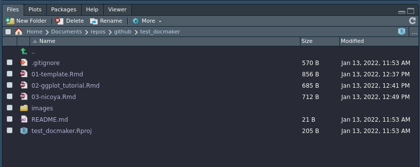
 
### `.gitignore` advice

In order to not make your control version slow or run out of space in your
GitHub account, ignore some files writting them in your `.gitignore` file.

Just open that file in RStudio and add the following lines to not include images,
data, credentials or other files that are not necessary for control versioning:


In there I added:

```
# Personal files
data/
images/
*.html
.Renviron
```
### Sending your changes to your github repository.

For this example I'm not using branches to avoid focusing on the git details, so
we are just going to send everything to the main branch. This step is

```{bash, eval = FALSE}
git add .
git commit -m "Add first notes"
git push
```

Be aware that this is probably going to ask you for who you are (user name on
GitHub and email) and your credentials. One tip to save your credentials for
the specific repository that you are working on is the following command after
you enter your credentials:

```{bash, eval = FALSE}
git config credential.helper store
```

## Deploy and publish your notes with `docmaker`

So far, we have our notes. But we are still lacking the part of publishing in
our web page the notes. There are several steps to do this manually but after
many times repeating everything I decided to create a small R package to
automatize this steps.

You can install the package with:

```{r, eval = FALSE}
devtools::install_github("ronnyhdez/docmaker")
```

Now, on your console you can load the package:

```{r, eval = FALSE}
library(docmaker)
```

### Configure repo with `docmaker`

Before building and deploying our notes, we need to do some configuration steps
in our repository. `docmaker` can take care of this with the function:

```{r, eval = FALSE}
build_repo(github_page_url = "https://ronnyhdez.github.io/test_docmaker/",
           site_author = "Ronny A. Hernández Mora")
```

We can get the URL of our repository in the settings > page on GitHub. After
we enabled this in a step before, there should appear the URL designated by
GitHub for our web site.

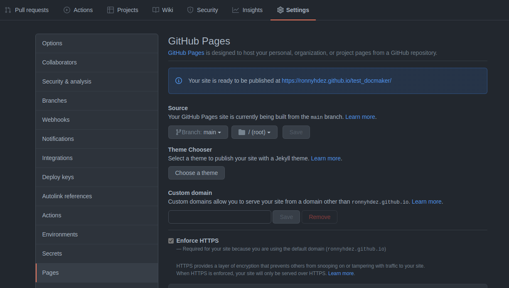

The `site_author` should be our name.

This function will do the following:

 - Create a `yml` file
 - Add to the `.gitignore` the `site` folder
 - Create a `docs` folder

### Build and deploy notes

Because this is our first time, all of our notes (three in the example) are not
existing as `md` documents nor even built or deploy with mkdocs.

`docmaker` have a function to take **all the .Rmd files** existing in our project
root and do all the steps needed to deploy this ones:

```{r, eval = FALSE}
make_all_docs(deploy = TRUE)
```

This function will do the following:

 - Render all our `Rmd` files to `md`
 - Move the outputs (including images) to the `docs` folder
 - If we are using a `README.Rmd` file **this will be ignore**
 - Build the mkdocs
 - If `deploy` is set to `TRUE` it will deploy the notes.
 - Create an specifi branch for the pages deployment: `gh-deploy`
 
Now, given that we are using a new branch to be deployed, we need to go back to
GitHub pages and make a small change: change the branch selected to be build from:

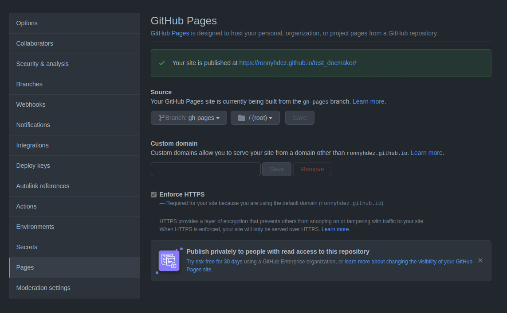

After some seconds (or a few minutes), we should be able to see our site alive!


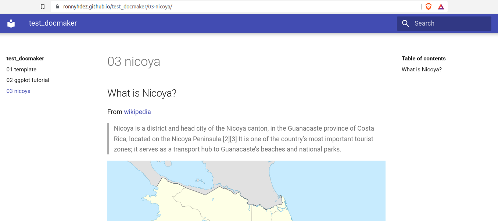

As we can see, our 3 files are sections in the left side menu. The titles and
subtitles of each document will be shown in the **Table of contents** in the
right side menu.

## Code and example site

All the code and configuration files of the example site are in this GitHub
repository:

 - [Repository](https://github.com/ronnyhdez/test_docmaker)
 - [Site](https://ronnyhdez.github.io/test_docmaker/03-nicoya/)

