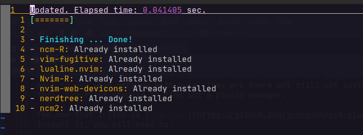

```{r setup, include=FALSE}
knitr::opts_chunk$set(echo = TRUE, eval = FALSE)
```

# How to install and config nvim in Ubuntu?

There is a ton of tutorials in the internet about this, but after trying
several times, the steps that worked for me are the following:

```{bash}
sudo apt install neovim -y
```

Then you can validate the version with:

```{bash}
nvim --version
```

Now that we have nvim installed in our computer, it's time to configure it. 
First you need to create the config file that would be in the path `~/.config/nvim/`

```{bash}
# Create directory
mkdir ~/.config/nvim/
cd ~/.config/nvim/

# Create nvim config file
nvim init.vim 
```

From there, you will see an empty file. We are going to add some configuration.
There are many options to adapt nvim to your needs and lots of examples out
there. Here I'm going to use a basic configuration so you can get an idea on
what you can do.

To understand the file, take notes on this:

 - Every `"` means that the line is a comment
 - All other lines without the `"` are instructions to set your configuration
 - `Plug` means that you want to use a Plugin. You will need a plugin to manage
 these. (More on this later)
 
This is what a basic config file would look like:

```
" Cursor as a block
set guicursor=

" Use relative numbers in files
set relativenumber

" Line where I'm positioned is the real line number
set nu

" No saving or keeping buffer in the background
set hidden

" Indentetation configuration
set tabstop=4 softtabstop=4
set shiftwidth=4
set expandtab
set smartindent

" Start scrolling until 8 spaces away
set scrolloff=8

" Create extra column
set signcolumn=yes

" Mark 80 characters line
set colorcolumn=80

" Set encoding
set encoding=utf-8

" Plugins
call plug#begin()
Plug 'jalvesaq/Nvim-R'
Plug 'preservim/nerdtree'
Plug 'tpope/vim-fugitive'
Plug 'ncm2/ncm2'
Plug 'gaalcaras/ncm-R'
call plug#end()
```

A good idea for me is that, when I add a new line of configuration, I will add
a comment stating what that command is mean for. That way, it will be easy for
me to remember what I was trying to achieve when I made the change.

## Instaling Plug-ins

In the `init.vim` file above, I included already some of the plugins that I
want to use when working with nvim. They are there but still not installed. For
this, the first step is to find out a plugin manager. 

The one that I like is [vim-plug](https://github.com/junegunn/vim-plug). To 
install it, you will need to:

```{bash}
sh -c 'curl -fLo "${XDG_DATA_HOME:-$HOME/.local/share}"/nvim/site/autoload/plug.vim --create-dirs \
       https://raw.githubusercontent.com/junegunn/vim-plug/master/plug.vim'
```

After the `vim-plug` is installed, you will need to go back to your `init.vim`
document. Then install the rest of plugins with:

```{bash}
:PlugInstall
```

When installing the rest of the plugins, you will see something similar to:

```{r, eval = TRUE, echo = FALSE, fig.cap = "Output after finishing the Plugins installation", out.extra = "class=external", layout="l-body-outset"}

```


