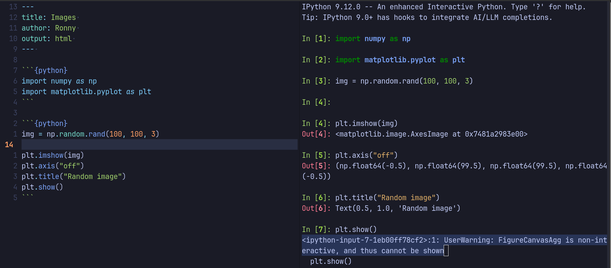
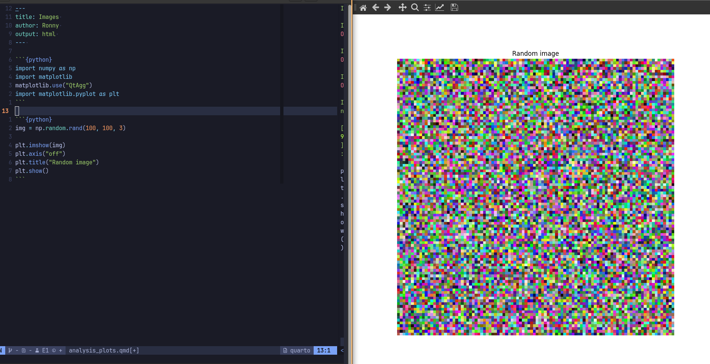

## The setup 

I'm using nvim + quarto for my day-to-day work. Nowadays this work consists of
displaying annotated images, processed satellite images, or plots resulting
from a data analysis. I'm switching between projects in Python and R, but most
of the work that requires checking intermediate steps from processing images
is with Python. 

Given that those images are intermediate results, I don't need to save them as
files, so I just need to display them during the working session and make a 
decision on the next step or validation. 

One option could be to  use the render option to check the quarto output, but I
don't want to deal with the computation of each chunk of code, or freezing
results. I'd rather simply plot some of the intermediate results and check
the results/images for validation. 

## The problem 

Because I'm using the terminal with neovim there is no way to show interactively
a plot, unless you save the figure, and open it. But that means moving away from
my terminal. And when working I want to stay in my terminal. 

So, if I try to run the following code:

```{python}
import numpy as np
import matplotlib
import matplotlib.pyplot as plt
```

```{python}
img = np.random.rand(100, 100, 3)

plt.imshow(img)
plt.axis("off")
plt.title("Random image")
plt.show()
```

I'll obtain the following error:




## The solution 

One solution is to use QtAgg to setup the matplotlib
[backend](https://matplotlib.org/stable/users/explain/figure/backends.html#backends)

This solution will combine using [PyQt6](https://pypi.org/project/PyQt6/), which 
will help by opening a new window with the figure I want to quickly check. 

### The steps for the solution

At the start of any project I use uv to setup the env: 

```{bash}
uv init
uv venv

uv pip install pyqt6 matplotlib jupyter

source .venv/bin/activate

nvim analysis_plots.qmd
```

## Implementation 

```{python}
import numpy as np
import matplotlib
matplotlib.use("QtAgg")

import matplotlib.pyplot as plt
```

```{python}
img = np.random.rand(100, 100, 3)

plt.imshow(img)
plt.axis("off")
plt.title("Random image")
plt.show()
```

When running each chunk of code, I'll have the output in the IPython console,
but when it comes to the section where I want to show the image, a new window
is created to display the figure:



## Important note

One critical detail about this solution: `matplotlib.use("QtAgg")` must be called
**before** importing `matplotlib.pyplot`. The backend needs to be set before the
plotting interface is initialized. If you import `pyplot` first and then try to
set the backend, it will have no effect and you'll still encounter the display error.

This workflow allows me to stay in my terminal, quickly validate intermediate results,
and continue working without the overhead of rendering the full Quarto document or
saving temporary image files.
